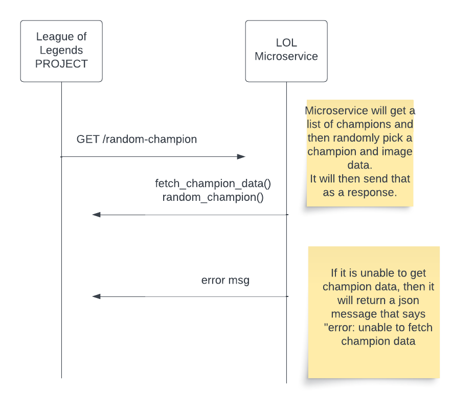

# Random League of Legends Champion Microservice

## Introduction

A simple Flask-based microservice that returns a random League of Legends champion's name and image using Riot’s [Data Dragon API](https://developer.riotgames.com/docs/lol#data-dragon).


## Features

- `/` — Welcome/status JSON
- `/random-champion` — Returns champion data in JSON
- `/view-champion` — HTML view of a random champion
- Built-in test coverage:
  - `testMicroservice.py` — Manual browser preview
  - `test_app.py` — Automated unit tests (Pytest)
  - `main.py` — Unified test runner that launches server, runs tests, and shuts down


## Requirements
- Python 3.x
- Flask
- Requests
- pytest (for testing)

## Installation and Setup
1. Clone the repository: `git clone https://github.com/aseabroo/LOLmicroservice.git`.
2. Navigate to the repository directory: `cd LOLmicroservice`.
3. (Optional) Set up a virtual environment: `python -m venv venv` and activate it.
4. Install required packages: `pip install -r requirements.txt`.

## Running the Microservice
Run the microservice using the command: `python LOLmicroservice.py`.
The service will be available at `http://localhost:5000/random-champion` or `http://127.0.0.1:5000/random-champion`.

## Testing with Python File
To test the microservice, run the command: `python LOLmicroservice.py`. 
Then, run the test file: `python testMicroservice.py`. 
This test will generate a randomly selected champion by making a request to the microservice. The microservice will respond with the champion's name and image link.

## Automated Unit Tests
pytest test_app.py -v
Tests:
- Root / route responds
- JSON data structure from /random-champion
- HTML contains expected tags

## Unified Test and Server Runner
This script does it all:
- Launches Flask server
- Waits for readiness
- Runs both tests
- Cleans up the process
- python main.py

## Usage in Your Project
To use this microservice in your project, you can make an HTTP GET request to the `/random-champion` endpoint.

## API Endpoint Details
- **Endpoint**: `/random-champion`
- **Method**: GET
- **Response Format**: JSON
- **Example Response**:
  ```json
  {
    "h": 48,
    "image": "http://ddragon.leagueoflegends.com/cdn/13.23.1/img/champion/Urgot.png",
    "name": "Urgot",
    "sprite": "champion4.png",
    "w": 48,
    "x": 432,
    "y": 48
  }

## UML Diagram


## Author
Developed by @aseabroo - QA minded engineer with a focus on automation, clarity, and clean execution
Built for engineering demo purposes and scalable testing practice