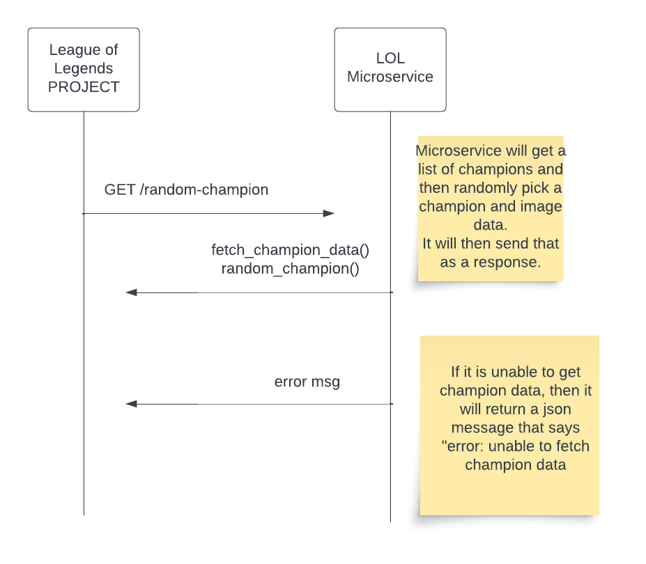

# Random League of Legends champion

A small Python/Flask service that fetches champion data from Riot's Data Dragon and returns a random champion as JSON or a simple HTML page.

## Run locally

Use Python 3.10 or newer.

```bash
git clone https://github.com/aseabroo/LOLmicroservice.git
cd LOLmicroservice
python3 -m venv .venv
source .venv/bin/activate
python -m pip install -r requirements.txt
python LOLmicroservice.py
```

On Windows, activate the environment with `.venv\Scripts\activate`.

| Route | Response |
| --- | --- |
| `/` | Service message and available routes |
| `/random-champion` | One champion's name, image URL, and sprite coordinates |
| `/view-champion` | A simple HTML page for one champion |

Open http://127.0.0.1:5000/view-champion. Champion requests need an internet connection.

If champion data is unavailable, both champion routes return HTTP `503`. The JSON route returns an error object; the HTML route displays a short message. The upstream request has a five-second timeout. This is a network timeout, not a guarantee that the entire request finishes within five seconds.

## Tests

With the environment activated:

```bash
python -m pytest test_app.py -q
```

The 17 test cases use Flask's test client and replace the upstream HTTP request with a controlled response. No running server or internet connection is needed for these tests.

They check successful JSON and HTML responses, request timeouts, connection failures, upstream HTTP errors, invalid JSON, and empty or malformed champion data. The small hand-written [fixture](tests/fixtures/champions.json) keeps the successful result predictable; it is not a live Data Dragon snapshot.

For example, the JSON route returns this result with that fixture:

```json
{
  "name": "Ahri",
  "image": "https://ddragon.leagueoflegends.com/cdn/13.23.1/img/champion/Ahri.png",
  "sprite": "champion0.png",
  "x": 48,
  "y": 0,
  "w": 48,
  "h": 48
}
```

These tests do not verify the live Riot service or download the champion image.

`testMicroservice.py` provides a manual preview against a running server. `main.py` is an optional macOS/Linux helper that starts the server, runs the preview and tests, and waits for Enter before stopping the server on the successful path.

## A small maintenance change

The September 2026 update adds a request timeout and a consistent failure result. Previously, the fetch function sometimes returned an error string, which the HTML route then treated as a dictionary. It also let network and JSON errors escape. Both routes now handle unavailable data explicitly.

This update and its tests were developed with AI assistance. The original project remains a small learning application. A [request walkthrough](docs/request-walkthrough.md) explains the code and includes questions to practice answering.

## Limitations and next steps

- The data URL is fixed to patch `13.23.1`.
- Every champion request downloads the data again; there is no cache or retry policy.
- The checks cover common unusable responses, not a complete validation of every field in Riot's schema.
- The helper needs reliable cleanup when a test fails.
- A fresh live-data demo still needs to be checked separately.

## Diagram and data source



Champion data and images come from [Riot Games Data Dragon](https://developer.riotgames.com/docs/lol#data-dragon). Original project by Augustus Seabrooke; see [LICENSE](LICENSE).
